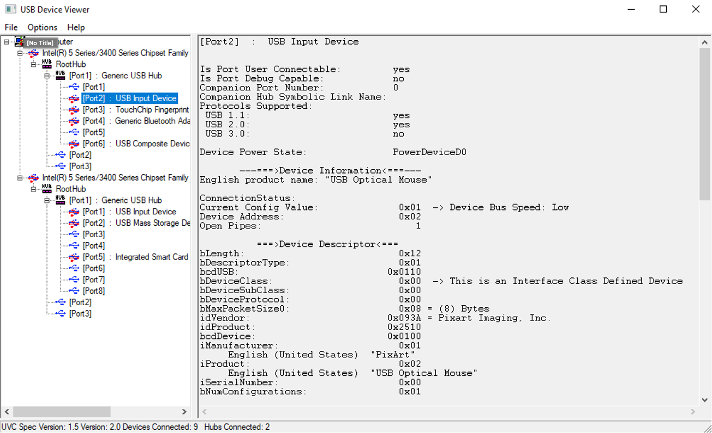

# USB Hacking

## USB Hacking Tools for Linux/MAC and Windows
There are a number of tools available for the Linux/MAC and Windows operating systems that we can use when profiling and hacking USB connections.
#### USB Hacking Tools for Linux and MAC
On the Unix/Linux and the MAC the standard tool for profiling and identifying USB connections is called *lsusb*. The following is the online help page for *lsusb*.
On Linux systems we can install *lsusb* using the following command: *$apt install lsusb*.
```sh
$ lsusb -h
Usage: lsusb [options]...
List USB devices
  -v, --verbose
      Increase verbosity (show descriptors)
  -s [[bus]:][devnum]
      Show only devices with specified device and/or
      bus numbers (in decimal)
  -d vendor:[product]
      Show only devices with the specified vendor and
      product ID numbers (in hexadecimal)
  -D device
      Selects which device lsusb will examine
  -t, --tree
      Dump the physical USB device hierarchy as a tree
  -V, --version
      Show version of program
  -h, --help
      Show usage and help
$ 
```
Simply running the *lsusb* command will produce a list of devices that are currently connected to the target computer system. 
It will display the bus that the device is connected to along with the device identifier and description of the device.
```sh
$ lsusb
Bus 001 Device 001: ID 1d6b:0002 Linux Foundation 2.0 root hub
Bus 002 Device 011: ID 0403:6001 Future Technology Devices International, Ltd FT232 Serial (UART) IC
Bus 002 Device 009: ID 0e0f:0008 VMware, Inc. VMware Virtual USB Mouse
Bus 002 Device 003: ID 0e0f:0002 VMware, Inc. Virtual USB Hub
Bus 002 Device 002: ID 0e0f:0003 VMware, Inc. Virtual Mouse
Bus 002 Device 001: ID 1d6b:0001 Linux Foundation 1.1 root hub
$ 
```
We can also use the *lsusb* tool to identify the class of USB device (eg. Wireless or Hub), along with the type of device driver required by the USB device.
```sh
$ lsusb -t
/:  Bus 02.Port 1: Dev 1, Class=root_hub, Driver=uhci_hcd/2p, 12M
    |__ Port 1: Dev 2, If 0, Class=Human Interface Device, Driver=usbhid, 12M
    |__ Port 2: Dev 3, If 0, Class=Hub, Driver=hub/7p, 12M
        |__ Port 1: Dev 9, If 0, Class=Wireless, Driver=btusb, 12M
        |__ Port 1: Dev 9, If 1, Class=Wireless, Driver=btusb, 12M
        |__ Port 2: Dev 11, If 0, Class=Vendor Specific Class, Driver=ftdi_sio, 12M
/:  Bus 01.Port 1: Dev 1, Class=root_hub, Driver=ehci-pci/6p, 480M
$ 
```
We can also use *lsusb* to find detailed information about a specific USB device if we known its 
vendor identifier (idVendor) and its product identifier (idProduct). The key elements that we are 
interested in are confirming that the Manufacturer and Product is what we expect it to be be, and 
that we can identify the data transfer type and data packet size.
```sh
$ lsusb -d 0x0e0f:0x0003 -v
Bus 002 Device 002: ID 0e0f:0003 VMware, Inc. Virtual Mouse
Device Descriptor:
  bLength                18
  bDescriptorType         1
  bcdUSB               1.10
  bDeviceClass            0 
  bDeviceSubClass         0 
  bDeviceProtocol         0 
  bMaxPacketSize0         8
  idVendor           0x0e0f VMware, Inc.
  idProduct          0x0003 Virtual Mouse
  bcdDevice            1.03
  iManufacturer           1 VMware
  iProduct                2 VMware Virtual USB Mouse
  . . . . . . 
      Endpoint Descriptor:
        bLength                 7
        bDescriptorType         5
        bEndpointAddress     0x81  EP 1 IN
        bmAttributes            3
          Transfer Type            Interrupt
          Synch Type               None
          Usage Type               Data
        wMaxPacketSize     0x0008  1x 8 bytes
        bInterval               1
$ 
```
The *usb-devices* is another Linux tool that can be used to profile a set of USB devices. 
This tool provides not only the *Bus* and *Device* identifier, but also manufacturer and product information.
```sh
$ usb-devices

T:  Bus=01 Lev=00 Prnt=00 Port=00 Cnt=00 Dev#=  1 Spd=480 MxCh= 6
D:  Ver= 2.00 Cls=09(hub  ) Sub=00 Prot=00 MxPS=64 #Cfgs=  1
P:  Vendor=1d6b ProdID=0002 Rev=05.04
S:  Manufacturer=Linux 5.4.0-48-generic ehci_hcd
S:  Product=EHCI Host Controller
S:  SerialNumber=0000:02:03.0
C:  #Ifs= 1 Cfg#= 1 Atr=e0 MxPwr=0mA
I:  If#=0x0 Alt= 0 #EPs= 1 Cls=09(hub  ) Sub=00 Prot=00 Driver=hub
. . . . . . . . . . .
$ 
```

#### USB Hacking Tools for Microsoft Windows
The standard tools used to profile and gather intelligence about USB connections in the Microsoft Windows Operating system are contained in the SDK. For MicroSoft Windows 10 the SDK tool *devcon* can be located at: https://docs.microsoft.com/en-gb/windows-hardware/drivers/devtest/devcon. In the following example we are going to use the *devcon* tool to identify all devices to type *USB* that can connect to the operating system.
```sh
C:\>devcon findall =USB
USB\ROOT_HUB20\4&25BC73E0&0                                 : USB Root Hub
USB\VID_046D&PID_0A66\6&1ADC9119&0&1                        : USB Composite Device
USB\VID_046D&PID_C313\5&1BADB653&0&11                       : USB Composite Device
USB\VID_046D&PID_0A66\6&37942266&0&4                        : USB Composite Device
USB\VID_0951&PID_1666\08606E6D3FE5BF303337EC21              : USB Mass Storage Device
USB\VID_046D&PID_085E\29317058                              : Logitech BRIO
USB\VID_0451&PID_8140\5&1BADB653&0&19                       : Generic SuperSpeed USB Hub
USB\ROOT_HUB30\4&52BDE52&0&0                                : USB Root Hub (USB 3.0)
USB\VID_2109&PID_0812\5&1BADB653&0&16                       : Generic SuperSpeed USB Hub
USB\VID_059B&PID_0032\8032487F934E3821                      : Iomega USB Bus Powered Zip 250
USB\VID_046D&PID_0A66\5&1BADB653&0&14                       : USB Composite Device
USB\VID_0781&PID_5591\4C530001111127119231                  : USB Mass Storage Device
USB\VID_21A9&PID_1006\0000000004BE                          : Saleae Logic Pro 16 USB Logic Analyzer
USB\VID_064F&PID_03E9\000002086370                          : USB Mass Storage Device
USB\VID_174C&PID_1153\00000000000000000000                  : USB Mass Storage Device
USB\VID_090C&PID_1000\SCY0000000102485                      : USB Mass Storage Device
USB\VID_0BDA&PID_0321\201312261010                          : Realtek USB 3.0 Card Reader
USB\VID_1F75&PID_0903\1874321027                            : USB Mass Storage Device
USB\ROOT_HUB20\4&2266B0C5&0                                 : USB Root Hub
USB\VID_2109&PID_2812\5&1BADB653&0&5                        : Generic USB Hub
USB\VID_8087&PID_8002\5&31D9FF4&0&1                         : Generic USB Hub
. . . . . . . . . . 
29 matching device(s) found.

C:\>
```
The other tool that we can use for profiling USB connections on Micorosft Windows is cann *USBVIEW*. 
This allows to navigate in a graphical form between various USB devices.

## Installation of the USB module in Python 3.8
We can install the pyusb module using PIP
```sh
$ pip install pysub
```
Or we can install the modules using the Conda utility.
```sh
$ conda install pyusb
```
Or you can use *pip* to install all of the Python dependencies via the following:
```sh
$ pip install requirements.txt
```
We can then test that the module has been installed correctly by importing it in Python.
```sh
$ python
Python 3.8.3 (default, Jul  2 2020, 11:26:31)
[Clang 10.0.0 ] :: Anaconda, Inc. on darwin
Type "help", "copyright", "credits" or "license" for more information
>>> 
>>> import usb.core
>>>
>>> import usb.util 
>>>
```
## USB Hacking Tools in Python
The following are the tools that we can use when hacking a USB connection on a embedded system. 

  - usbfind.py

## usbfind
The role and function of the usbfind tool is to enumerate all USB connections on a target system. When enumerating a USB connection we can choose to be verbose or succint. 
Verbose output will not only profile the USB device but also the USB connection and the USB endpoint in the operating system.
```sh
$ python ./usbfind.py -h

Program: usbfind.py - Version: 1.0 - Author: ab@merimetso.net - Date: 2020/10/21

USAGE: usbfind.py [-h] [-v] [-s bus:device] [-b backend]

 Optional Arguments:
    -h    Show this help message and exit.
    -v    Display verbose USB information. Please note this argument overrules -s
    -s    Specify a specific USB device to profile. The device must be specified as a bus:devic
              For example, you can profile the device locate at BusID:001 and DeviceID:006 as
              $ python usbfind.py -s 001:006. Please note numbers must be decimal.
    -b     Specify the backend responsible for process USB API calls. For example to use the 
              /usr/lib/libusb-1.0.so backend we would specify: $ python usbfind.py -b 1
EXAMPLE:
    To produce a verbose profile of the device locate at BusID:002 and DeviceID:005 using the 
    libusb backend to process all USB API calls we would use the following:
        $ python usbfind.py -v -s 002:005 -b 1

$ 
```
In the following example we are going to gnerate a succinct list USB device connected to a target system.
```sh
$ python usnfind.py
Running USB Profiling Tool - Version: 1.0 - Author:ab@merimetso.net

Manufacturer    : 0x3
Product         : 0x2
Device Class    : 0x9
Device Protocol : 0x0
Device SubClass : 0x0
Device Version  : 05.04
Device DevNum   : 0x1
Device Filename : 
Serial Number   : 0x1
Product ID      : 0x2
Vendor ID       : 0x1d6b
Max Packet Size : 0x40
USB Version     : 02.00
. . . . . . . . . . . . . . .
$ 
```
We can also choose to profile a USB connection in verbose mode.
```sh
$ python usbfind.py -v
Running USB Profiling Tool - Version: 1.0 - Author:ab@merimetso.net

DEVICE ID 1d6b:0002 on Bus 001 Address 001 =================
 bLength                :   0x12 (18 bytes)
 bDescriptorType        :    0x1 Device
 bcdUSB                 :  0x200 USB 2.0
 bDeviceClass           :    0x9 Hub
 bDeviceSubClass        :    0x0
 bDeviceProtocol        :    0x0
 bMaxPacketSize0        :   0x40 (64 bytes)
 idVendor               : 0x1d6b
 idProduct              : 0x0002
 bcdDevice              :  0x504 Device 5.04
 iManufacturer          :    0x3 Error Accessing String
 iProduct               :    0x2 Error Accessing String
 iSerialNumber          :    0x1 Error Accessing String
 bNumConfigurations     :    0x1
  CONFIGURATION 1: 0 mA ====================================
   bLength              :    0x9 (9 bytes)
   bDescriptorType      :    0x2 Configuration
   wTotalLength         :   0x19 (25 bytes)
   bNumInterfaces       :    0x1
   bConfigurationValue  :    0x1
   iConfiguration       :    0x0 
   bmAttributes         :   0xe0 Self Powered, Remote Wakeup
   bMaxPower            :    0x0 (0 mA)
    INTERFACE 0: Hub =======================================
     bLength            :    0x9 (9 bytes)
     bDescriptorType    :    0x4 Interface
     bInterfaceNumber   :    0x0
     bAlternateSetting  :    0x0
     bNumEndpoints      :    0x1
     bInterfaceClass    :    0x9 Hub
     bInterfaceSubClass :    0x0
     bInterfaceProtocol :    0x0
     iInterface         :    0x0 
      ENDPOINT 0x81: Interrupt IN ==========================
       bLength          :    0x7 (7 bytes)
       bDescriptorType  :    0x5 Endpoint
       bEndpointAddress :   0x81 IN
       bmAttributes     :    0x3 Interrupt
       wMaxPacketSize   :    0x4 (4 bytes)
       bInterval        :    0xc

. . . . . . . . . . . . . . .
$ 
```
## Bug Report
  - Please report bugs, error and omissions to *ab@merimetso.net*
  
## License
  - MIT

